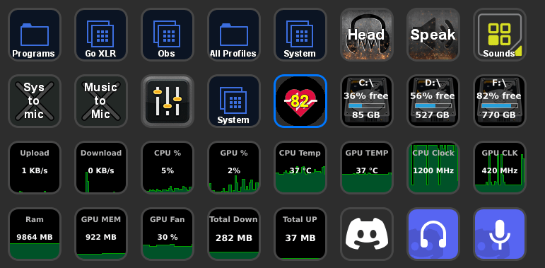

# Description

`HypeRate` is a plugin that will display your heart rate on your stream deck.

# Features

- code written in Javascript
- cross-platform (macOS, Windows)
- persistent settings
- localized

# Installation

In the Release folder, you can find the file `com.hyperate.hyperate.streamDeckPlugin`. If you double-click this file on your machine, Stream Deck will install the plugin.

# Source code

The Sources folder contains the source code of the plugin.