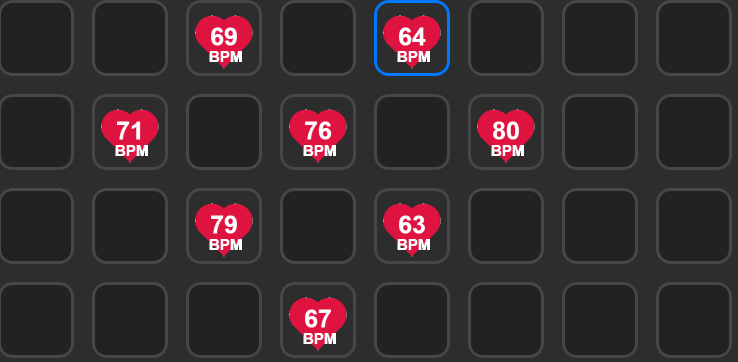

# Description

`HypeRate` is a plugin that will display your heart rate on your stream deck.

# Features

- code written in Javascript
- cross-platform (macOS, Windows)
- persistent settings
- localized

# Installation

Download available in the Stream deck store the [Stream Deck ](https://apps.elgato.com/plugins/com.hyperate.hyperate).

Download available in the [Releases](https://github.com/Ianchandler1990/HypeRate-StreamDeck-plugin/releases) section.

# Source code

The Sources folder contains the source code of the plugin.

📫 How to reach me [Twitch](https://www.twitch.tv/ianchandler1990) [Twitter](https://twitter.com/IanChandler1990)
